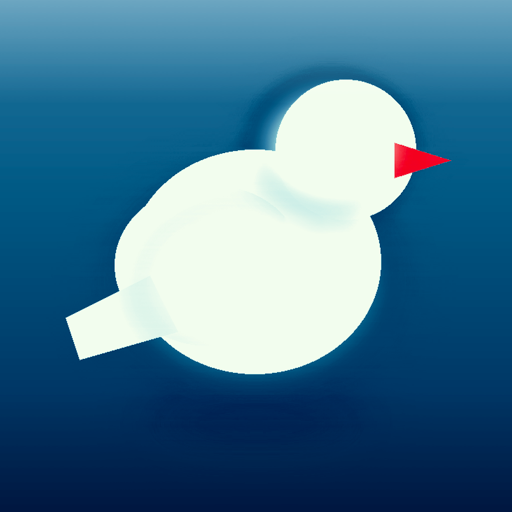

# IconForge

IconForge turns a sentence about an app into a finished macOS icon.

You type a name and what the app does. IconForge works out what object to draw, writes the image prompt, and hands it to whichever agentic CLI you picked, `agy` or `codex`. Then it does the part that usually gets skipped: it cuts the artwork to the right shape for the Mac you are on, adds the edge treatment that makes an icon catch light instead of looking like a flat picture, and builds every size Apple asks for. What comes out is an `.icns` you can drop straight into a bundle, plus a clipboard instruction that tells a coding agent to install it for you.

Generate up to four at once and keep the one you like. If one is nearly right, say what to change in plain words and IconForge edits that icon instead of starting over.


Four it made, unretouched:

<p>
  
  
  
  
</p>

## What you need

- macOS 14 or later
- Either `agy` or `codex`, runnable from your shell. Check with `which agy` or `which codex`. You choose between them in the app and you do not need both.
- Xcode command line tools, for `swift` and `iconutil`. Run `xcode-select --install` if `iconutil` is missing.

`sips` and `iconutil` ship with macOS, so there is nothing else to install.

## Install

```bash
./install.sh
```

That builds a release binary, wraps it in `IconForge.app`, ad-hoc signs it, and copies it to `/Applications`. Launch it from Spotlight afterwards.

To run it without installing, `./build_app.sh && open build/IconForge.app` uses the same bundle out of `build/`.

There is no Homebrew formula, since this repo is not published anywhere. Use the install script.

## Using it

Fill in the name and a short description. Everything else is optional.

- **Subject** is the object the icon shows. Leave it blank and IconForge asks the model to pick one. Whatever it picks shows up beside the label, so you can copy it into the field and edit it if you want to steer the next roll.
- **Palette** opens a grid of 192 trending [Coolors](https://coolors.co/palettes/trending) palettes. Pick one and its hex values go into the prompt verbatim. Ignore the grid and you can type a direction instead, like "sea glass to deep teal", in the field underneath. Swapping the library for a different export takes one command: `python3 Tools/generate_palettes.py your-palettes.json`, then rebuild.
- **Style** offers Standard, Playful, Minimal, Glossy, Technical, Editorial, Retro, Luxe, Organic and Neon. Each one also narrows which surface materials the render can roll, so Editorial draws paper and card rather than injection-moulded plastic.
- **Finish** is a local pass over the finished artwork. Flat leaves it alone. Apple edge lights the top lip and shades the base the way system icons catch light. Glossy dome adds a highlight across the top half, Deep shadow throws the shadow further, and Punchy enriches the colour. Switching between them re-renders in milliseconds and never calls the model, so trying all five costs nothing.
- **Body size** is how much of the tile the icon fills. Read [the note on macOS 26](#the-white-plate-on-macos-26) before you change it.
- **Generator** is the CLI that draws. `agy` reports its own models and bakes the reasoning effort into the model name, which is why the effort control greys out next to it. `codex` offers `gpt-5.6-luna`, `gpt-5.6-terra` and `gpt-5.6-sol`, and takes the effort separately, from low to max. Model names do not carry across, so switching generator resets the picker to that CLI's default.
- **Model** lists whatever `agy models` reports, minus the Claude entries. The button beside the picker re-reads it. To change what gets filtered, edit `excludedModelPrefixes` in `Sources/IconForge/AgyRunner.swift`. Under `codex` the list is fixed and the refresh button disappears.
- **Icons per run** draws up to four at once, each with its own subject and its own art direction. They appear as a row under the preview, and clicking one makes it the active icon for Export, Reveal and the agent prompt.

Press Generate. One icon takes about half a minute on `gemini-3.1-pro-high`, the default. Four run in parallel and take roughly as long as the slowest. Cheaper models are faster but noticeably flatter, and in testing they ignored the palette hex values more often.

A batch keeps whatever comes back. If one of the four calls fails, you still get the other three and the status line says so.

Reroll re-derives the subject rather than redrawing the same object. It steers away from the half dozen subjects it last used for that app, so a second press gives you a different idea. Type your own subject and it sticks, and only the art direction varies. The strip along the bottom holds every past run, and clicking one loads its icon and its inputs back into the window.

Settings covers the output folder, how many tries each icon gets before IconForge gives up on it, how long a single call may run, and a path field for each generator.

### Editing an icon you almost like

The field under the preview takes a change in plain words. "Make the bird bigger", "drop the envelope", "warmer background". IconForge sends the existing artwork back with instructions to keep the subject, composition, angle and palette, and to change only what you asked for. The result appears beside the original rather than replacing it, so you can compare them and keep whichever won.

The wand button next to that field turns edit mode on without typing anything. Use it when the change you want is already in the pickers: choose a different palette or style, press Edit icon, and IconForge recolours or restyles the icon on screen rather than drawing a new one. While edit mode is on, the three fields an edit cannot honour (name, description and subject) grey out.

## Where the files go

Every run gets its own folder under `~/IconForge`, so nothing overwrites anything.

```
~/IconForge/
  tidepool-20260714-101322/
    prompt.txt          # the exact prompt that was sent
    source_raw.png      # what the generator returned, untouched
    icon_1024.png       # the masked 1024 icon
    AppIcon.iconset/    # all ten sizes Apple requires
    AppIcon.icns        # the macOS icon
    AppIcon.ico         # Windows fallback
    meta.json           # inputs and model, for the gallery
```

Change the folder in Settings, or use Export to copy a finished set somewhere else. Clear empties the window without touching anything on disk.

**Copy as agent prompt** puts an instruction on the clipboard that points a coding agent at these exact files and tells it to install the icon on whatever app you have open in that session, then rebuild and reinstall. It covers the common stacks, so it works whether the project is a Swift package, Tauri, Electron, Flutter or a plain web app. Paste it and let the agent do the wiring.

## How the icon is built

1. IconForge centre-crops the raw artwork and redraws it at 1024x1024, whatever size came back.
2. It lays on the chosen finish: a lit top lip, a shaded base, and a hairline just inside the silhouette, all clipped so nothing spills.
3. Unless the body size is Full bleed, it clips a squircle out of that. The corners come from a superellipse rather than circular arcs, so the curve meets each edge without a visible seam. It then centres the masked body on a transparent canvas with a soft shadow beneath.
4. It renders every required size from the 1024 master, and `iconutil` packs the `.iconset` into an `.icns`.
5. It writes a `.ico` alongside, with PNG entries from 16 to 256 pixels.

Steps 2 and 3 are pure Core Graphics and read only from `source_raw.png`. That is why changing the finish or the body size re-renders instantly, and why switching back undoes it.

The prompt never mentions rounded squares or app icons. It asks for a 3D render of one object on a gradient, because describing the artifact pushes the model toward drawing icon presentations, borders and badges that then have to be argued back out of it. The rounding happens here in step 3, or in macOS itself.

### The white plate on macOS 26

Tahoe wraps any legacy `.icns` in a system-drawn rounded plate and centres the artwork on it. An icon that carries its own mask and margin ends up sitting inside that plate, and the plate reads as a white border around your icon. Three body sizes handle this:

| Setting | Body | Use when |
|---|---|---|
| Apple standard | 824 of 1024 | Targeting macOS 14 or 15, matching Apple's template exactly |
| Large | 928 of 1024 | Same, but you want the icon to sit larger in the Dock |
| **Full bleed** | Plain 1024 square, no mask | macOS 26, where the system does the rounding. The default. |

Full bleed skips the squircle, the margin and the shadow on purpose. The white border is two masks stacking, so on macOS 26 IconForge drops its own and lets the system supply the only one.

### Tuning the shape

The geometry lives at the top of [`Sources/IconForge/IconPipeline.swift`](Sources/IconForge/IconPipeline.swift):

```swift
static let canvas: CGFloat = 1024
static let bodySize: CGFloat = 824
static let cornerRadiusRatio: CGFloat = 0.2237
static let squircleExponent: CGFloat = 5
static let shadowBlur: CGFloat = 22
static let shadowOffsetDown: CGFloat = 10
static let shadowOpacity: CGFloat = 0.28
```

Raise `squircleExponent` for squarer corners, or lower it toward 2 for a plain rounded rectangle. Rebuild and the change shows up in the next preview, including the placeholder outline.

### The prompts

Two prompts do the work, both in [`Sources/IconForge/PromptBuilder.swift`](Sources/IconForge/PromptBuilder.swift). The first is a text-only call asking for objects worth drawing, mixing a literal choice with a lateral one and refusing the usual gear and lightbulb clichés. It also asks for a short note on each object's physical shape, which goes into the image prompt so the model draws the thing you meant rather than inventing a form for the noun. The second is the image prompt, assembled from your inputs plus a randomly rolled material, camera angle and composition, so two presses of Generate never hand back the same picture. Both are plain string builders. Edit them, rebuild, and the next icon uses the new wording.

## When something breaks

**Could not find the agy command**, or the codex one, usually means the binary sits somewhere the app cannot see. Apps launched from Finder get a bare `PATH`, so a binary in `~/.local/bin` is invisible to them even though it works in Terminal. IconForge checks the usual install directories and asks your login shell. If it still comes up empty, paste the output of `which agy` or `which codex` into the matching field in Settings. Each generator has its own field, because pointing one at the other's binary makes the CLI reject arguments it has never heard of.

**An unknown model** shows up as a non-zero exit with the generator's own message attached. Refresh the model list in Settings and pick again.

**No image appeared** means the generator finished without writing a file, which usually means the model refused the prompt. Reroll and it normally goes through.

**The model list will not load** means `agy models` failed or took longer than 30 seconds, and the picker falls back to the default. The error sits under the picker in Settings.

## Project layout

A plain Swift Package, no Xcode project:

```
Package.swift
Info.plist                 # copied into the bundle by build_app.sh
build_app.sh               # compile and assemble IconForge.app
install.sh                 # build_app.sh, then copy to /Applications
Resources/AppIcon.icns     # the app's own icon, made with IconForge
Sources/IconForge/
  IconForgeApp.swift       # @main scene
  ContentView.swift        # window, preview, gallery, settings
  GeneratorModel.swift     # run state, history, file layout
  AgyRunner.swift          # finding and driving agy or codex
  PromptBuilder.swift      # the prompt template and style variants
  IconPipeline.swift       # squircle, shadow, iconset, icns
  ICOWriter.swift          # Windows .ico container
```

`swift build` works on its own if you only want the binary. The app needs the bundle to behave like a normal window app, so use `build_app.sh`.
