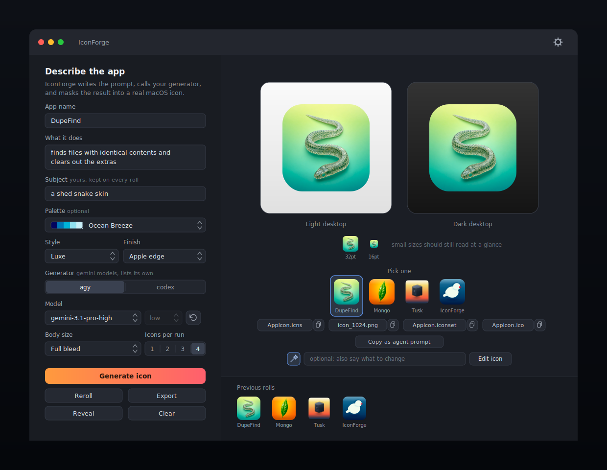
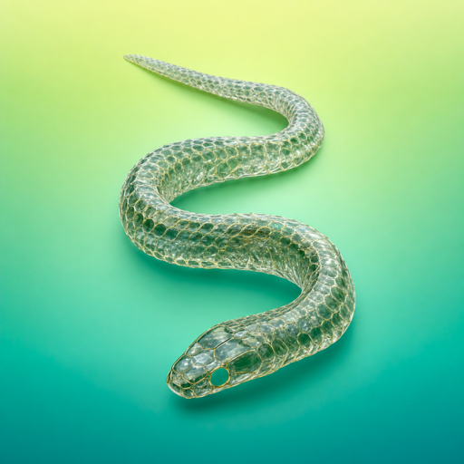
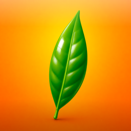
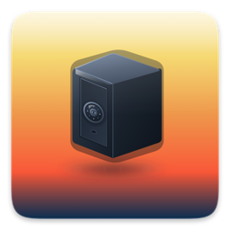
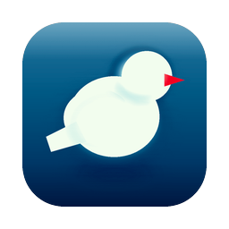

# IconForge

IconForge turns a sentence about an app into a finished macOS icon.

You type a name and what the app does. IconForge decides what object to draw, writes the image prompt, hands it to an agentic CLI — `agy` or `codex`, whichever you pick — and then does the part that usually gets skipped: it cuts the artwork to the right shape for the Mac you are on, adds the edge treatment that makes an icon catch light instead of looking like a flat picture, and builds every size Apple asks for. You get an `.icns` you can drop straight into a bundle, plus a clipboard instruction that tells a coding agent to install it for you.

Generate up to four at a time and keep the one you like. If it is nearly right, say what to change in plain words and IconForge edits that icon rather than starting over.



Four it made, unretouched:

<p>
  
  
  
  
</p>

## What you need

- macOS 14 or later
- At least one of `agy` or `codex`, runnable from your shell. Check with `which agy` or `which codex`. You pick between them in the app; you do not need both.
- Xcode command line tools, for `swift` and `iconutil`. Run `xcode-select --install` if `iconutil` is missing.

`sips` and `iconutil` ship with macOS, so there is nothing else to install.

## Install

```bash
./install.sh
```

That builds a release binary, wraps it in `IconForge.app`, ad-hoc signs it, and copies it to `/Applications`. Launch it from Spotlight afterwards.

If you would rather not install it, `./build_app.sh && open build/IconForge.app` runs the same bundle out of `build/`.

There is no Homebrew formula because this repo is not published anywhere. The install script is the one command.

## Using it

Fill in the name and a short description. Everything else is optional:

- **Subject** is the object the icon shows. Leave it blank and IconForge asks the model to pick one, then writes its answer back into the field so you can edit it and reroll.
- **Palette** opens a grid of 192 trending [Coolors](https://coolors.co/palettes/trending) palettes. Pick one and its hex values go into the prompt verbatim, or ignore the grid and type a direction like "sea glass to deep teal" in the field below it. To swap the library for a different export, run `python3 Tools/generate_palettes.py your-palettes.json` and rebuild.
- **Style** picks the look: Standard, Playful, Minimal, Glossy, Technical, Editorial, Retro, Luxe, Organic or Neon. Each one also biases which surface finish the render rolls, so Editorial gets paper and card rather than injection-moulded plastic.
- **Finish** is a local pass over the finished artwork: Flat leaves it alone, Apple edge lights the top lip and shades the base the way system icons catch light, Glossy dome adds a highlight over the top half, Deep shadow throws it further, Punchy enriches the colour. Switching between them re-renders in milliseconds and never calls the model, so it costs nothing to try all five.
- **Body size** decides how much of the tile the icon fills. See [the note on macOS 26](#the-white-plate-on-macos-26) before changing it.
- **Generator** chooses which CLI draws. `agy` reports its own models and carries the reasoning effort inside the model name, so the effort picker greys out. `codex` offers `gpt-5.6-luna`, `gpt-5.6-terra` and `gpt-5.6-sol`, and takes the effort separately, from low to max. Model names do not carry between the two, so switching resets the picker to that CLI's default.
- **Model** lists what `agy models` reports, minus the Claude entries. Refresh it with the button next to the picker. To change what gets filtered out, edit `excludedModelPrefixes` in `Sources/IconForge/AgyRunner.swift`. Under `codex` the list is fixed and the refresh button goes away.
- **Icons per run** generates up to four at once, each with its own subject and its own art direction. They appear as a row under the preview and clicking one makes it the active icon for Export, Reveal and the agent prompt.

Press Generate. One icon takes half a minute or so on `gemini-3.1-pro-high`, the default; four run in parallel and take about as long as the slowest. Cheaper models are faster but noticeably flatter, and in testing they ignored the palette hex values more often.

Reroll changes the idea, not just the pixels. A subject IconForge picked for you is thrown away and re-derived, steering clear of the half dozen it last used for that same app, so a second press gives you a different object rather than the same one drawn again. Type your own subject and it sticks: only the art direction varies. The strip along the bottom keeps every past run, and clicking one loads its icon and inputs back into the window.

### Editing an icon you almost like

The field under the preview takes a change in plain words: "make the bird bigger", "drop the envelope", "warmer background". IconForge sends the existing artwork back with instructions to keep the subject, composition, angle and palette and change only what you asked for. The result appears beside the original rather than replacing it, so you can compare and keep whichever won.

## Where the files go

Every run gets its own folder under `~/IconForge`, so nothing overwrites anything:

```
~/IconForge/
  tidepool-20260714-101322/
    prompt.txt          # the exact prompt sent to agy
    source_raw.png      # what agy returned, untouched
    icon_1024.png       # the masked 1024 icon
    AppIcon.iconset/    # all ten sizes Apple requires
    AppIcon.icns        # the macOS icon
    AppIcon.ico         # Windows fallback
    meta.json           # inputs and model, for the gallery
```

Change the folder in Settings, or use the Export button to copy a finished set somewhere else. Clear empties the window without touching anything on disk.

**Copy as agent prompt** puts an instruction on the clipboard that points a coding agent at these exact files and tells it to install the icon on whatever app you have open in that session, then rebuild and reinstall. Paste it and let the agent do the wiring.

## How the icon is built

1. The raw artwork is centre-cropped and redrawn at 1024x1024, whatever size `agy` returned.
2. The chosen finish goes on: a lit top lip, a shaded base and a hairline just inside the silhouette, all clipped so nothing spills.
3. Unless the body size is Full bleed, a squircle path is clipped out of it, with continuous corners built from a superellipse rather than circular arcs, so the curve meets each edge without a visible seam. The masked body is then centred on a transparent canvas with a soft shadow beneath.
4. Every required size is rendered from the 1024 master, and `iconutil` packs the `.iconset` into an `.icns`.
5. A `.ico` is written alongside it with PNG entries from 16 to 256 pixels.

Steps 2 and 3 are pure Core Graphics and read only from `source_raw.png`, which is why changing the finish or the body size re-renders instantly and can be undone by switching back.

The prompt never mentions rounded squares or app icons at all. It asks for a 3D render of one object on a gradient, because describing the artifact pulled the model toward drawing icon presentations, borders and badges that then had to be argued out of it. The rounding happens here in step 3, or in macOS itself.

### The white plate on macOS 26

Tahoe wraps any legacy `.icns` in a system-drawn rounded plate and centres the artwork on it. An icon carrying its own mask and margin ends up sitting inside that plate, and the plate reads as a white border around your icon. Three body sizes handle this:

| Setting | Body | Use when |
|---|---|---|
| Apple standard | 824 of 1024 | Targeting macOS 14 or 15, matching Apple's template exactly |
| Large | 928 of 1024 | Same, but you want the icon to sit larger in the Dock |
| **Full bleed** | Plain 1024 square, no mask | macOS 26, where the system does the rounding. The default. |

Full bleed deliberately skips the squircle, the margin and the shadow: two masks fighting each other was the whole problem.

### Tuning the shape

The geometry lives at the top of [`Sources/IconForge/IconPipeline.swift`](Sources/IconForge/IconPipeline.swift):

```swift
static let canvas: CGFloat = 1024
static let bodySize: CGFloat = 824
static let cornerRadiusRatio: CGFloat = 0.2237
static let squircleExponent: CGFloat = 5
static let shadowBlur: CGFloat = 22
static let shadowOffsetDown: CGFloat = 10
static let shadowOpacity: CGFloat = 0.28
```

Raise `squircleExponent` for squarer corners, lower it toward 2 for a plain rounded rectangle. Rebuild and the change shows up in the next preview, including the placeholder outline.

### The prompts

Two prompts do the work, both in [`Sources/IconForge/PromptBuilder.swift`](Sources/IconForge/PromptBuilder.swift). The first asks a text-only call to name the objects worth drawing, mixing the literal choice with a lateral one and refusing the usual gear and lightbulb clichés. The second is the image prompt, assembled from your inputs plus a randomly rolled material, camera angle and composition, so two presses of Generate never hand back the same picture. Both are plain string builders. Edit them, rebuild, and the next icon uses the new wording.

## When something breaks

**Could not find the agy command** — or the codex one — usually means the binary is somewhere the app cannot see. Apps launched from Finder get a bare `PATH`, so a binary in `~/.local/bin` is invisible to them even though it works in Terminal. IconForge checks the usual install directories and asks your login shell, but if it still comes up empty, paste the output of `which agy` or `which codex` into the matching field in Settings. Each generator has its own path field, because pointing one at the other's binary makes the CLI reject arguments it has never heard of.

**An unknown model** shows up as a non-zero exit from agy with its own message attached. Refresh the model list in Settings and pick again.

**No image appeared** means agy finished without writing a file, which normally happens when the model refused the prompt. Reroll and it usually goes through.

## Project layout

A plain Swift Package, no Xcode project:

```
Package.swift
Info.plist                 # copied into the bundle by build_app.sh
build_app.sh               # compile and assemble IconForge.app
install.sh                 # build_app.sh, then copy to /Applications
Resources/AppIcon.icns     # the app's own icon, made with IconForge
Sources/IconForge/
  IconForgeApp.swift       # @main scene
  ContentView.swift        # window, preview, gallery, settings
  GeneratorModel.swift     # run state, history, file layout
  AgyRunner.swift          # finding and driving the agy binary
  PromptBuilder.swift      # the prompt template and style variants
  IconPipeline.swift       # squircle, shadow, iconset, icns
  ICOWriter.swift          # Windows .ico container
```

`swift build` works on its own if you only want the binary, but the app needs the bundle to behave like a normal window app, so use `build_app.sh`.
